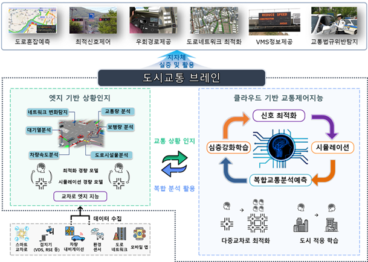
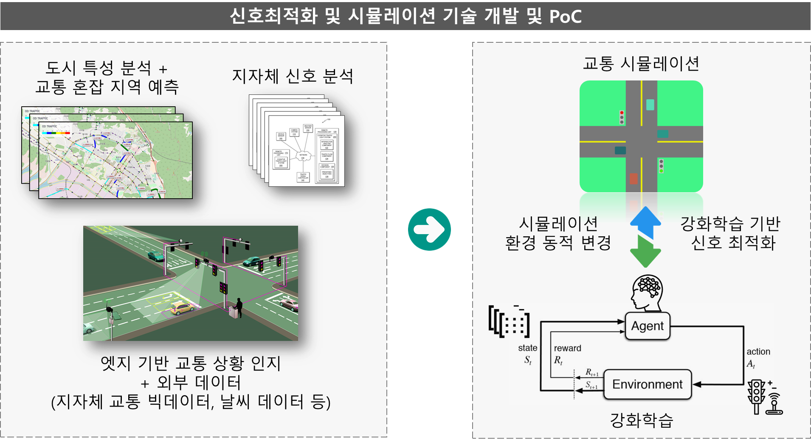
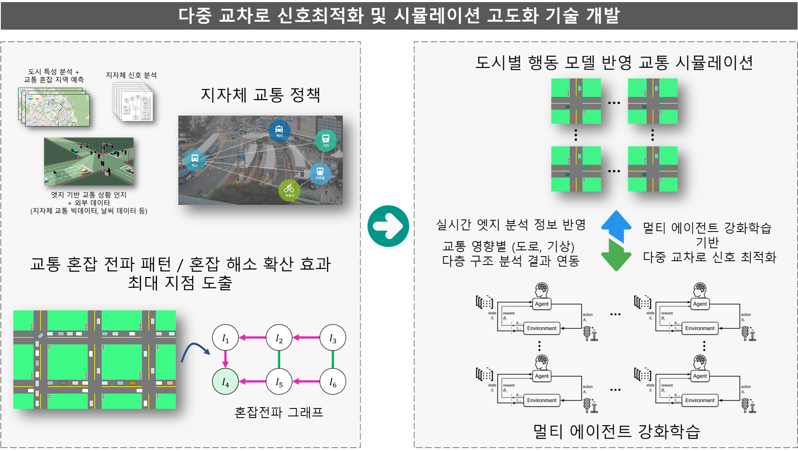
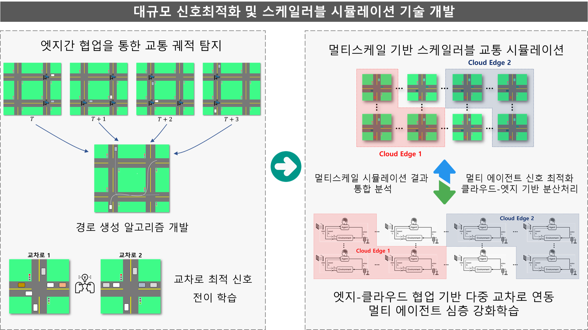
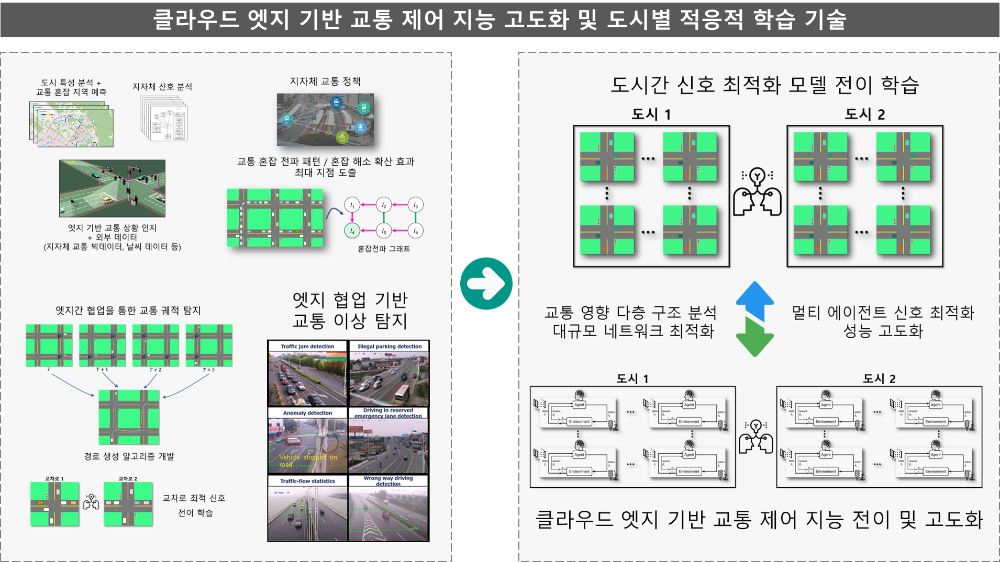

## 도시교통 브레인

O 주요 정량적 목표
   - 교차로 통과시간 감소율 15% 이상
   - 신호 최적화 신호 교차로 개수 200개 이상
   - 멀티 에이전트 신호 최적화의 클라우드-엣지 기반 분산 처리 지원
   - 신호 최적화 시각적 분석 모듈 수 2개 이상
   - 혼잡 전파 예측 정확도 F1-score 0.85 이상
   - 교통 수요 추정 오차 MAPE　10 이하
   - 공개 SW 커미터급 개발자 50명 이상 양성

#
## 연구 내용
* [도시교통 브레인 핵심 SW] 엣지-클라우드 협업을 통한 교통 네트워크 신호최적화 기술 및 도시 전체의 파급효과를 검증하는 스케일러블 시뮬레이션 기술 개발 
* [클라우드 엣지 기반 교통상황인지 기술] 엣지-클라우드/엣지-엣지 간 협업을 통한 교통상황 인지 및 예측 기술 개발
* [계층적 교통 데이터 수집․가공․통합] 다양한 공공/민간 교통데이터를 활용하여 클라우드 기반 데이터 수집, 변환, 관리 및 시간/공간축에 따른 데이터 상호 연계 기술 개발 
* [실시간 교통상황분석 및 시각화 도구] 엣지-클라우드 협업기반 교통 모니터링, 교통 영향 인자별 최적 신호와의 연관 관계, 신호 최적화의 도시 전체 파급효과, 도시 간 유사 패턴의 시각적 분석을 위한 대시보드 개발
* [클라우드-엣지 통합 인프라 및 자원 관리 도구] 도시교통 브레인의 동적 확장이 가능한 클라우드-엣지 가상화 구조 기술, 도시교통 브레인 엣지 인프라 및 자원 관리 기술, 도시교통 브레인의 PaaS 플랫폼 기술 개발
* [도시교통 브레인 실증] 도시교통 브레인의 개발 결과물을 지자체 신호제어 및 교통 인프라에 적용하여 실증 
 
#
## 연차별 연구 내용 
### 1차년도

### 2차년도

### 3차년도

### 4차년도

